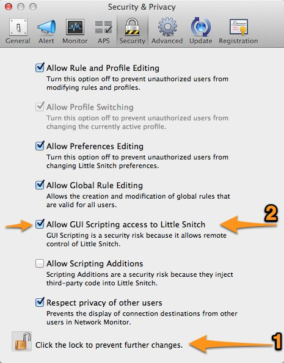

km-enable-disable-littlesnitch
==============================

There are two Keyboard Maestro macros here, to Enable or Disable Little Snitch's network filter using GUI scripting.

Both the scripts work entirely the same way:

*	Check to see if ***Little Snitch Configuration.app*** is running, save to a variable `QUIT_LITTLESNITCH`

*	Launch ***Little Snitch Configuration.app***

*	Open ***Little Snitch Configuration.app's*** preferences (see note below)

*	Click on the "General" tab (see note below)

*	Look for either a "Stop" button or "Start" button

	*	if a "Start" button is found when we want to enable the Network filter, press it

	*	if a "Stop" button is found when we want to disable the Network filter, press it

	*	if a "Start" button is found when we want to disable the Network filter, the network is already disabled (the presence of a "Start" button means that the filter is stopped).

	*	if a "Stop" button is found when we want to enable the Network filter, the network is already enabled (the presence of a "Stop" button means that the filter is already stopped).

*	If neither a "Start" or "Stop" button is found, prompt the user to see if GUI Scripting is enabled, and then cancel the macro.

*	Send <kbd>⌘</kbd> + <kbd>W</kbd> to close the preferences window

*	If `QUIT_LITTLESNITCH` is 'yes' then quit ***Little Snitch Configuration.app***

*This is the __Note Below__ that was mentioned above:* The 'click on General' step is *probably* unnecessary, since Little Snitch's preferences default to showing the "General" tab when it opens, but it feels like the right thing to do. For example, what if the preferences panel had already been opened to some other panel for some reason? Also, just for the sake of completeness, the macro opens the preferences panel using both the menu item *and* the keyboard shortcut. Doesn't hurt anything to do it twice, and if, for some reason, one of them misfires, the other could work.

### Warning! ###

In order for these macros to work, you have to enable GUI Scripting access to Little Snitch. **Doing so is a potential security risk, so understand what you're doing before you do it.** I consider the risk to be minimal and worth the trade-off. Use entirely at your own discretion. *Caveat emptor.*

To make that change, open ***Little Snitch Configuration.app*** and go to the "Security" pane, click the lock icon (bottom left) and then make sure the box next to "Allow GUI Scripting access to Little Snitch" as shown here:

### Installation ###

After installing [Keyboard Maestro], download the [Enable-or-Disable-LittleSnitch-Network-Filter.kmmacros][1] file. (n.b. the file can be named anything you want, just make sure that it ends with ".kmmacros" and nothing else (like .xml or .plist).

The easiest way to install it is simply to double click the '.kmmacros' file, which should import the macro into Keyboard Maestro and tell you that 2 macros were imported.

You can also use Keyboard Maestro's `File » Import Macros...` menu as shown here:

Then select the [Enable-or-Disable-LittleSnitch-Network-Filter.kmmacros][1] file from the Finder. You should get the same notification shown above.

[Keyboard Maestro]: http://www.keyboardmaestro.com/main/

[1]: https://raw.github.com/tjluoma/km-enable-disable-littlesnitch/master/Enable-or-Disable-LittleSnitch-Network-Filter.kmmacros

